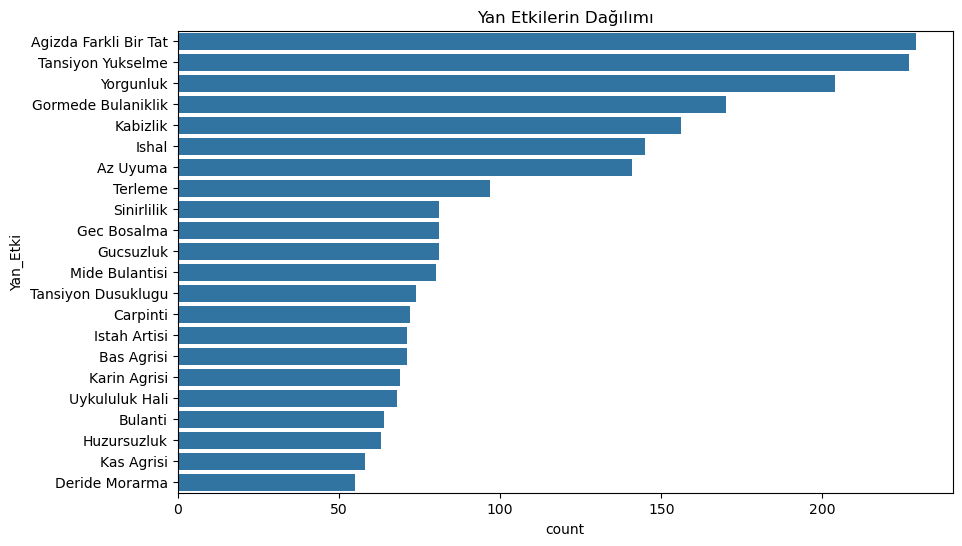
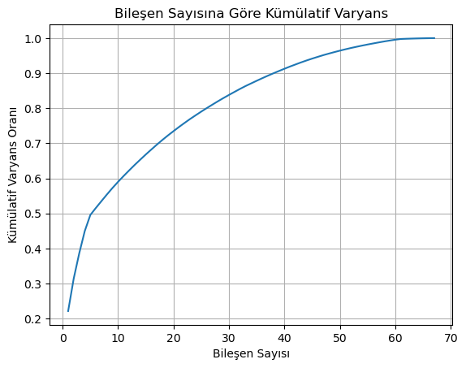

# Documentation of Analysis of Drug Side Effects

Gamze Genç 

gamzegenc99@gmail.com

## 1. Giriş

**Proje Tanımı:** Bu proje, ilaçların yan etkilerini inceleyen bir veri seti üzerinde gerçekleştirilen bir veri analizi ve ön işleme çalışmasıdır. Projenin temel amacı, veri setini keşfederek (EDA) ilaç kullanımı, hasta özellikleri ve yan etkiler arasındaki ilişkileri anlamaktır.

**Hedefler:**

- Veri setindeki değişkenlerin dağılımlarını ve istatistiksel özelliklerini anlamak.
- Değişkenler arasındaki korelasyonları ve ilişkileri belirlemek.
- Eksik verileri uygun yöntemlerle ele almak.
- Kategorik verileri makine öğrenmesi algoritmaları için uygun hale getirmek.
- Veri setini olası bir makine öğrenmesi modeli için hazırlamak.

**Problem Tanımı:** İlaç yan etkileri, hasta sağlığı ve güvenliği açısından önemli bir endişe kaynağıdır. Bu proje, ilaç yan etkilerini etkileyebilecek faktörleri belirlemeyi ve yan etki riskini tahmin etmek için potansiyel olarak kullanılabilecek bir makine öğrenmesi modeli geliştirme amacıyla veri setini analiz etmektedir.

**Sorular:**

- Hangi ilaçlar hangi yan etkilere daha sık neden oluyor?
- Hastaların demografik özellikleri (cinsiyet, yaş, vb.) ve sağlık geçmişi (alerjiler, kronik hastalıklar, vb.) yan etki riskini nasıl etkiliyor?
- Vücut kitle indeksi (BMI) ile yan etkiler arasında bir ilişki var mı?
- İlaç kullanım süresi yan etki görülme olasılığını artırıyor mu?

## 2. Veri Setinin Tanıtımı

**Veri Seti Açıklaması:** Bu projede kullanılan veri seti, hastaların ilaç kullanımları, kişisel bilgileri ve yaşadıkları yan etkiler hakkında bilgi içeren bir Excel dosyasından (`side_effect_data.xlsx`) oluşmaktadır.

**Değişkenler:** Veri setinde aşağıdaki gibi değişkenler bulunmaktadır:

- **Demografik Bilgiler:** Cinsiyet, Yaş, Boy, Kilo, İl, Uyruk
- **Sağlık Geçmişi:** Alerjiler, Kronik Hastalıklar, Ailede Kronik Hastalıklar (Anne, Baba, Kardeşler)
- **İlaç Bilgileri:** İlaç Adı, İlaç Başlangıç Tarihi, İlaç Bitiş Tarihi
- **Yan Etki Bilgileri:** Yan Etki, Yan Etki Bildirim Tarihi
- **Diğer:** Kan Grubu, Kullanıcı ID

**Veri Seti Boyutu:**  Veri seti, toplamda 2357 satır ve 19 sütun içermektedir.

## 3. Keşifsel Veri Analizi (EDA)

**Veri Yapısı:**

Veri seti, nümerik ve kategorik değişkenlerin bir karışımını içerir.

- **Nümerik Değişkenler:** `Boy`, `Kilo`, `Yas`. Bu değişkenlerin dağılımları histogramlar ile görselleştirilmiştir.
- **Kategorik Değişkenler:** `Cinsiyet`, `Il`, `Ilac_Adi`, `Yan_Etki`, `Alerjilerim`, `Kronik Hastalıklarim`, `Baba Kronik Hastaliklari`, `Anne Kronik Hastaliklari`, `Kiz Kardes Kronik Hastaliklari`, `Erkek Kardes Kronik Hastaliklari`, `Kan Grubu`
- Kategorik değişkenlerin frekans dağılımları, sütun grafikleri ile incelenmiştir.

**Görselleştirmeler:**

- **Histogramlar:** Sayısal değişkenlerin dağılımını anlamak için histogramlar kullanılmıştır.
- **Box Plotlar:** `Kilo`, `Boy` ve `Yas` değişkenleri için box plotlar çizilerek aykırı değerler görselleştirilmiştir.
- **Scatter Plot:** `Boy` ve `Kilo` arasındaki ilişkiyi incelemek için scatter plot kullanılmıştır.
- **Count Plotlar:** Kategorik değişkenlerin frekanslarını ve bazı değişkenler arasındaki ilişkileri (örneğin, `Cinsiyet` ve `Yan_Etki`, `Ilac_Adi` ve `Yan_Etki`) görselleştirmek için kullanılmıştır.

**Önemli Bulgular:**

- **En sık görülen yan etkiler belirlenmiştir.**
    
    
    | **Yan Etki** | **Görülme Sayısı** |
    | --- | --- |
    | Ağızda Farklı Bir Tat | 229 |
    | Tansiyon Yükselmesi | 227 |
    | Yorgunluk | 204 |
    | Görmede Bulanıklık | 170 |
    | Kabızlık | 156 |
    | İshal | 145 |
    | Az Uyuma | 141 |
    | Terleme | 97 |
    | Sinirlilik | 81 |
    | Geç Boşalma | 81 |
    
    
    
- **Bazı ilaçlar diğerlerine göre daha fazla yan etkiye sahip olabil**ir.
    
    
    
    - **Analiz ve Bulgular**
        - **En Çok Yan Etkiye Sahip İlaç:** Lurasidone isimli ilaç, grafiğe göre en fazla yan etkisi olan ilaçtır. Özellikle baş dönmesi, uyuklama hali ve ağızda farklı bir tat gibi yan etkiler sıklıkla görülmektedir.
        - **Ortak Yan Etkiler:** Birçok ilaçta ortak olarak görülen yan etkiler arasında baş ağrısı, yorgunluk, bulantı ve sinirlilik bulunmaktadır. Bu durum, bu yan etkilerin bazı ilaçların genel bir özelliği olabileceğini veya tedavi sürecinin normal bir parçası olabileceğini düşündürmektedir.
        - **İlaç Bağımlılığı ve Yan Etkiler:** Bazı ilaçların belirli yan etkilere neden olma olasılığı daha yüksektir. Örneğin, hydrocortisone cream gibi topikal kortikosteroidler genellikle kaşıntı ve yanma gibi lokal yan etkilere neden olurken, antidepresanlar daha çok uyku düzeninde bozulma ve cinsel işlev bozukluklarına yol açabilir.
        - **Yan Etki Sıklığı:** Grafik, bazı ilaçların diğerlerine göre daha az yan etkiye neden olduğunu göstermektedir. Bu durum, ilaçların etkinlik ve güvenilirlik açısından farklılık gösterebileceğini ve bu nedenle ilaç seçimi yapılırken doktorun önerilerinin dikkate alınmasının önemini vurgulamaktadır.
- **Cinsiyet ve İlaç Yan Etkisi İlişkisi** `Cinsiyet` ve `Yan_Etki` arasında bir ilişki olabilir.
    
    
    
    - **Genel Bakış:**
        - **Benzer Yan Etki Profili:** Her iki cinsiyet için de en sık görülen yan etkiler kabızlık, yorgunluk, baş ağrısı, görmede bulanıklık ve sinirlilik gibi ortak noktalar göstermektedir. Bu durum, birçok ilacın her iki cinsiyette benzer fizyolojik süreçleri etkileyebileceğini düşündürmektedir.
        - **Bazı Yan Etkilerde Cinsiyet Farklılıkları:** Grafiğe bakıldığında, bazı yan etkilerin kadınlarda veya erkeklerde daha sık görüldüğü dikkat çekmektedir. Örneğin, "ağızda farklı bir tat" ve "deride morarma" gibi yan etkiler erkeklerde daha sık bildirilirken, "huzursuzluk" ve "uyku hali" gibi yan etkiler kadınlarda daha sık görülmektedir.
        - **Varyasyon:** Her iki cinsiyette de yan etki sıklıklarında önemli bir varyasyon olduğu görülmektedir.
- **Kişinin Doğum tarihi baz alınarak Yaşı hesaplanmıştır.**
- **`Kilo` ,`Boy` , Yaş değişkenlerinde aykırı değerlerin olmadığı  tespit edilmiştir.**
- **Anomaliler ve Eksik Veriler:**
    - **Eksik Veriler:** Veri setinde bazı değişkenlerde eksik veriler bulunmaktadır.
    - **Anomaliler:** Z-skoru yöntemi ve box plotlar kullanılarak aykırı değerler tespit [edilmiştir.Ve](http://edilmiştir.Ve) aykırı değerler bulunmamaktadır.
        
        
        | Değişken | Eksik Değer Sayısı | Eksik Değer Yüzdesi |
        | --- | --- | --- |
        | Cinsiyet | 778 | 33.01% |
        | Alerjilerim | 484 | 20.53% |
        | Kronik Hastalıklarım | 392 | 16.63% |
        | Kan Grubu | 347 | 14.72% |
        | Kilo | 293 | 12.43% |
        | İl | 227 | 9.63% |
        | Anne Kronik Hastalıkları | 217 | 9.21% |
        | Baba Kronik Hastalıkları | 156 | 6.62% |
        | Erkek Kardeş Kronik Hastalıkları | 121 | 5.13% |
        | Boy | 114 | 4.84% |
        | Kız Kardeş Kronik Hastalıkları | 97 | 4.12% |

## 4. Veri Ön İşleme

- **Yeni Değişkenler Türetme:**
    - **İlaç Kullanım Süresi:** `Ilac_Baslangic_Tarihi` ve `Ilac_Bitis_Tarihi` değişkenleri kullanılarak `Ilac_Kullanım_Suresi` değişkeni hesaplanmıştır.
    - **Yan Etkinin Ortaya Çıkma Süresi:** `Yan_Etki_Bildirim_Tarihi` ve `Ilac_Baslangic_Tarihi` değişkenleri kullanılarak `Yan_Etki_Ortaya_Cikma_Suresi` değişkeni hesaplanmıştır.
    - **Vücut Kitle İndeksi (BMI):** `Kilo` ve `Boy` değişkenleri kullanılarak BMI hesaplanmış ve `BMI` değişkeni oluşturulmuştur.
        - BMI değerleri kullanılarak hastalar "Zayıf", "Normal Kilo", "Fazla Kilo" ve "Obez" kategorilerine ayrılmış ve `BMI_category` değişkeni oluşturulmuştur. Bu kategorileştirme, BMI değerlerinin yan etkilerle olan ilişkisini analiz etmeyi kolaylaştırır.
- **Gereksiz Sütunların Silinmesi:**
    - `Dogum_Tarihi`, `Ilac_Baslangic_Tarihi`, `Ilac_Bitis_Tarihi`, `Yan_Etki_Bildirim_Tarihi`, `Uyruk`, `Kullanici_id` sütunları veri setinden çıkarılmıştır.
- **Eksik Verilerin Yönetimi:**
    
    Eksik veriler, makine öğrenmesi modelleri için problem oluşturabilir. Bu nedenle, eksik verileri ele almak için farklı yöntemler kullanılmıştır:
    
    - **Sayısal Değişkenler:** `Kilo` ve `Boy` değişkenlerindeki eksik değerler, ortalama (`mean`) ile doldurulmuştur (kod satırı 215-217). Ortalama, veri setinin genel dağılımını fazla etkilemeden ve aykırı değerler olmadığında eksik değerleri doldurmak için yaygın bir yöntemdir.
    - **Kategorik Değişkenler:** `Cinsiyet`, `Il`, `Kan Grubu`, `Alerjilerim` ve kronik hastalıklarla ilgili sütunlardaki eksik değerler "Bilinmiyor" değeri ile doldurulmuştur. Bu, eksik değerleri yeni bir kategori olarak ele alır ve modelin bu bilgiyi öğrenmesine ve önyargılı kararlar vermemesine olanak tanır.
- **Kategorik Değişkenlerin Kodlanması:**
    
    Kategorik değişkenler, makine öğrenmesi algoritmaları tarafından doğrudan kullanılamaz. Bu nedenle, sayısal değerlere dönüştürülmeleri gerekir. Bu projede aşağıdaki kodlama yöntemleri kullanılmıştır:
    
    - **Label Encoding:** `Cinsiyet` ve `Kan Grubu` değişkenleri, Label Encoding ile kodlanmıştır. Bu yöntem, her bir kategoriye benzersiz bir sayısal değer atar.
    - **One-Hot Encoding:** `Il`, `Ilac_Adi`, `Yan_Etki` ve `Alerjilerim` değişkenleri, One-Hot Encoding ile kodlanmıştır. Bu yöntem, her bir kategori için yeni bir ikili (0 veya 1) değişken oluşturur. `drop_first=True` parametresi, çoklu doğrusal bağlantıyı önlemek için ilk kategorinin düşürülmesini sağlar.
    - **Multi-Label Binarization:** Kronik hastalıklar ile ilgili sütunlar (`Kronik Hastaliklarim`, `Baba Kronik Hastaliklari`, vb.) için Multi-Label Binarization kullanılmıştır. Bu yöntem, birden fazla kategori içerebilen değişkenleri ayrı ikili sütunlara dönüştürür.
    - **Ordinal Encoding:** `BMI_category` değişkeni, Ordinal Encoding ile kodlanmıştır. Bu yöntem, kategoriler arasında doğal bir sıralama olduğunda kullanılır. Zayıf<Normal Kilo<Fazla Kilo<Obez
- **Normalizasyon/Standartlaştırma:**
    
    Nümerik değişkenlerin farklı ölçeklerde olması, bazı makine öğrenmesi algoritmalarının performansını olumsuz etkileyebilir. Bu nedenle, `Kilo`, `Boy`, `Yas`, `Ilac_Kullanım_Suresi`, `Yan_Etki_Ortaya_Cikma_Suresi` ve `BMI` değişkenleri standartlaştırılmıştır. Standartlaştırma, her bir değişkenin ortalamasını 0 ve standart sapmasını 1 yapar. Bu işlem, değişkenlerin aynı ölçekte olmasını sağlar ve aykırı- çarpık değerler olmadığı için de modelin daha iyi performans göstermesine yardımcı olabilir.
    
- **Boyut İndirgeme Teknikleri: PCA Analiz**
    
    **Amaç:** Bu çalışmada,  veri setinin boyutunu azaltmak ve modelleme süreçlerini hızlandırmak amacıyla PCA (Baş Bileşen Analizi) uygulanmıştır.
    
    - **Veri seti:** Orijinal (2357, 281) boyutundaki veri seti, PCA ile (2357, 47) boyutuna indirilmiştir.
        
        **PCA Uygulaması:**
        
        - Scikit-learn kütüphanesinin PCA sınıfı kullanılarak analiz gerçekleştirilmiştir.
        - Tüm sayısal değişkenler analize dahil edilmiştir.
        
        **Varyans Açıklama Oranı:**
        
        - Her bir bileşenin açıkladığı varyans oranları incelendiğinde, ilk birkaç bileşenin toplam varyansın büyük bir kısmını açıkladığı görülmüştür.
        - Kümülatif varyans grafiği,%95 varyansın ilk 47 bileşenle açıklandığını göstermektedir.
        
        **Optimal Bileşen Sayısı:**
        
        - Verinin %95'ini açıklamak için 47 bileşen seçilmiştir. Bu sayede, veri boyutu önemli ölçüde azaltılarak hesaplama maliyetleri düşürülmüştür.
        
        **Dönüştürülmüş Veri:**
        
        - Boyut düşürülmüş yeni veri seti, 47 boyutlu bir uzayda temsil edilmektedir.
        - Yeni veri setinin ilk birkaç satırı:
            
            `[[ 0.33767082 -0.1217441   1.12051145 ...  0.26660479  0.36099609
              -0.01594355]
            [-0.76284227 -1.38576289  1.75297489 ... -0.01176919  0.25668019
              -0.01307239]
            # ...
            ]`
            
    
    
    
    **Grafiği Yorumlama**
    
    - **Grafik Eğrisi:** Grafikte genellikle artan bir eğri görürüz. Bu, eklenen her yeni bileşenle açıklanan toplam varyansın arttığını gösterir.
    - **Doyma Noktası:** Bir noktadan sonra eğri daha yavaş yükselmeye başlar. Bu nokta, eklenen yeni bileşenlerin çok az ek varyans açıkladığı anlamına gelir. Bu nokta, genellikle **"dirsek noktası"** olarak adlandırılır ve boyut indirme için seçilebilecek optimal bileşen sayısını gösterir.
    
    **Neden Bu Grafiği Kullanıyoruz?**
    
    - **Optimal Bileşen Sayısını Belirleme:** Bu grafik sayesinde, veri kaybını en aza indirerek, verinin boyutunu en uygun şekilde nasıl küçültebileceğimizi belirleriz. Genellikle, toplam varyansın %95 veya %99 gibi belirli bir oranını açıklayan bileşen sayısını seçeriz.
    - **Boyut İndirmenin Etkisini Görselleştirme:** Grafik, boyut indirme işleminin verideki bilgi kaybını ne kadar etkilediğini görselleştirmemizi sağlar.

***Veri ön işleme aşamasında yapılan işlemler şunlardır:***

- Yeni değişkenler türetilerek veri zenginleştirilmiştir.
- Analiz ve modelleme için gereksiz sütunlar silinmiştir.
- Eksik veriler uygun yöntemlerle doldurulmuştur.
- Kategorik değişkenler farklı kodlama yöntemleri kullanılarak sayısal hale getirilmiştir.
- Nümerik değişkenler standartlaştırılarak aynı ölçeğe getirilmiştir.
- Veri setinin boyutunu azaltmak ve modelleme süreçlerini hızlandırmak amacıyla PCA (Baş Bileşen Analizi) uygulanmıştır.

Veri ön işleme aşaması, verinin kalitesini artırmış ve modelin daha doğru ve güvenilir sonuçlar üretmesine yardımcı olacaktır.

## 5. Analiz Sonuçları

- **BMI Kategorileri göre Yan Etki Dağılımı**
    
    
    
    - **Yan Etki Çeşitliliği:** Her bir BMI kategorisinde birçok farklı yan etki gözlemlenmektedir. Bu, yan etkilerin tek bir nedene bağlı olmayıp, birçok faktörün bir araya gelmesiyle ortaya çıkabileceğini gösterir.
    - **Obezite ve Yan Etkiler:** Obez bireylerde, diğer kategorilere göre daha fazla sayıda ve çeşitlilikte yan etki gözlemlenmektedir. Bu durum, obezitenin birçok sağlık sorununa yol açabileceği ve ilaçların bu kişilerde farklı yan etkilere neden olabileceği şeklinde yorumlanabilir.
    - **Zayıflık ve Yan Etkiler:** Zayıf bireylerde de bazı yan etkiler görülmektedir. Ancak, obez bireylere göre daha az sayıda ve çeşitlilikte yan etki bildirilmiştir.
    - **Normal Kilo ve Yan Etkiler:** Normal kilodaki bireyler, diğer kategorilere göre daha az yan etki bildirmiştir. Ancak, bu durumun nedeni, örneğin bu grupta daha az ilaç kullanılması veya daha az yan etki bildirilmesi olabilir.

- **İstatistiksel Testler**: Yapılan testlerin sonuçları ve bulgular.
    - **Ki-kare Testi:** Kategorik değişkenler arasındaki ilişkinin istatistiksel olarak anlamlı olup olmadığını test etmek için Ki-kare testi kullanılmıştır. Örneğin, kod satırı 190-200 ve 205-214'te `Cinsiyet`, `Il`, `Ilac_Adi`, `Alerjilerim` gibi değişkenlerin `Yan_Etki` ile olan ilişkisi Ki-kare testi ile incelenmiştir. Düşük p-değerleri (genellikle 0.05'ten küçük), değişkenler arasında **istatistiksel olarak** anlamlı bir ilişki olduğunu gösterir.
        - **Ki-kare Değeri:** Ki-kare değeri, ilişkinin gücünü gösterir. Yüksek ki-kare değeri, ilişkinin daha güçlü olduğunu ifade eder.
        - **Serbestlik Derecesi:** Serbestlik derecesi, ki-kare dağılımını belirleyen bir parametredir. Bu değer, tablonun boyutuna ve kategorilerin sayısına bağlı olarak hesaplanır.
    - ***Kategorik değişkenlerin - Yan etki üzerinde istatistiksel etkisi(Ki-Kare Testi )***
        - Cinsiyet, il, kullanılan ilaç, alerjiler, kronik hastalıklar (kendi ve aile bireylerinin) ve kan grubu gibi değişkenlerin, yan etki oluşumu üzerinde **istatistiksel olarak** anlamlı bir etkisi bulunmamaktadır.
        - Yani, bu değişkenlerdeki farklılıklar, yan etki oluşma olasılığını etkilememektedir.
        - Bu analiz sonuçlarına göre, incelenen kategorik değişkenlerin hiçbirinin yan etki oluşumu üzerinde istatistiksel olarak anlamlı bir etkisi bulunamamıştır. Ancak, bu sonuç kesin değildir ve farklı nedenlerden dolayı ortaya çıkmış olabilir. Daha kesin sonuçlar için, daha büyük bir veri seti üzerinde, farklı istatistiksel yöntemler kullanılarak ve diğer olası etkileyen faktörler kontrol edilerek yeni bir analiz yapılması önerilir.
    - ***Kategorik değişkenlerin birbiriyleriyle olan ilişkileri(Ki-Kare Testi )***
        - **Cinsiyet ve Sağlık Durumu:** Cinsiyet değişkeni, birçok sağlık durumu (alerjiler, kronik hastalıklar, ailede kronik hastalık öyküsü vb.) ile anlamlı bir şekilde ilişkili bulunmuştur. Bu, cinsiyetin sağlık üzerinde farklı etkileri olabileceğini göstermektedir.
        - **Coğrafya (İl) ve Sağlık Durumu:** Yaşanan il ile sağlık durumu arasında da güçlü bir ilişki tespit edilmiştir. Bu, coğrafi farklılıkların sağlık durumunu etkileyebileceğini, çevresel faktörlerin, erişilebilir sağlık hizmetlerinin veya genetik farklılıkların rol oynayabileceğini düşündürmektedir.-
    - **Korelasyon Matrisi Nedir?**
        - Korelasyon matrisi, farklı sayısal değişkenler arasındaki ilişkinin gücünü ve yönünü gösteren bir tablodur. Bu matriste her bir hücre, iki değişken arasındaki korelasyon katsayısını verir. Korelasyon katsayısı -1 ile 1 arasında bir değer alır:
        - **1:** İki değişken arasında tam pozitif bir ilişki vardır. Bir değişken arttıkça diğeri de artar.
        - **1:** İki değişken arasında tam negatif bir ilişki vardır. Bir değişken arttıkça diğeri azalır.
        - **0:** İki değişken arasında anlamlı bir ilişki yoktur.
            
            
            
        - İncelenen değişkenler arasında genel olarak zayıf bir ilişki olduğunu göstermektedir. Bu, değişkenlerin birbirinden bağımsız veya çok az ilişkili olduğunu düşündürmektedir.
- **İlişkiler:**
    - **Cinsiyet ve Yan Etkiler:** Cinsiyet ve yan etkiler arasındaki ilişkiyi analiz etmek için çapraz tablolar ve görselleştirmeler kullanılmıştır. Örneğin,  `Cinsiyet` ve `Yan_Etki` değişkenleri arasında bir ilişki olup olmadığını anlamak için bir çapraz tablo oluşturulmuş ve bir count plot çizilmiştir. Bu analiz, belirli yan etkilerin kadınlarda veya erkeklerde daha sık görülüp görülmediğini ortaya koyabilir.
    - **Kilo ve Boy:** `Kilo` ve `Boy` arasındaki ilişkiyi incelemek için scatter plot kullanılmıştır. Bu grafik, kilo ve boy arasında pozitif bir korelasyon olup olmadığını gösterir.
    - **BMI ve Yan Etkiler:** BMI kategorileri ve yan etkiler arasındaki ilişkiyi analiz etmek için `groupby` ve `value_counts` fonksiyonları kullanılmıştır ve sonuçlar bir bar plot ile görselleştirilmiştir. Bu analiz, farklı BMI kategorilerine sahip hastalarda yan etki görülme sıklığını karşılaştırmayı sağlar.
    - **İlaç ve Yan Etkiler:** Belirli ilaçların belirli yan etkilere neden olma olasılığını analiz etmek için count plot kullanılmıştır. Bu grafik, hangi ilaçların hangi yan etkilerle daha sık ilişkili olduğunu gösterir.
    
    
    
    **Yüksek korelasyona sahip değişkenler: {'BMI_category'}"** çıktısı, veri setinde sadece "BMI_category" adlı değişkenin diğer değişkenlerle 0.8'den büyük bir korelasyona sahip olduğunu gösterir. Bu, "BMI_category" değişkeninin diğer değişkenlerden birini veya birkaçını oldukça iyi tahmin edebileceği anlamına gelir.
    

## 6. Sonuç ve Öneriler

**Ana Bulgular:**

- **Yan Etki Dağılımı:** Veri setindeki yan etkilerin dağılımı incelenmiş ve en sık görülen yan etkiler belirlenmiştir. Bu bilgi, yaygın yan etkileri hedef alan müdahaleler geliştirmek için kullanılabilir.
- **İlişkiler:** Değişkenler arasındaki ilişkiler analiz edilmiştir. Örneğin, belirli ilaçların belirli yan etkilerle daha sık ilişkili olduğu, cinsiyetin bazı yan etkilerin görülme sıklığını etkileyebileceği ve BMI kategorilerinin yan etki riskini etkileyebileceği gibi bulgular elde edilmiştir.
- **Eksik Veriler:** Veri setindeki eksik veriler uygun yöntemlerle ele alınmıştır. Bu, analiz sonuçlarının güvenilirliğini artırır.
- **Veri Dönüşümü:** Kategorik değişkenler kodlanmış ve nümerik değişkenler standartlaştırılmıştır. Bu, verileri makine öğrenmesi modelleri için uygun hale getirir.
- **Boyut azaltma:  PCA (temelBileşen Analizi) uygulayarak veri setinin boyutunu başarıyla azalttık.** Orijinal (2357, 281) boyutundaki veri seti, PCA ile (2357, 47) boyutuna indirilmiştir. Bu sayede:
    - **Hesaplama maliyetleri azaltıldı:** Daha düşük boyutlu veri seti ile model eğitimi ve tahmin işlemleri daha hızlı gerçekleştirilecektir.
    - **Overfitting riski azaltıldı:** Daha az özellik kullanarak modelin karmaşıklığı düşürüldü.
    - **Veri yorumlanabilirliği arttı:** PCA bileşenleri, verideki temel varyasyonları temsil eder. Bu sayede, verinin yapısı hakkında daha iyi bir anlayış elde edilebilir.
    - **PCA ile elde edilen 47 bileşen, orijinal verinin önemli bir kısmını açıklamaktadır.** Bu, model performansında önemli bir düşüşe neden olmadan boyut indirgeme yapılabileceğini gösterir.

**Gelecek Çalışmalar:**

- **Tahmine Dayalı Modelleme:** Ön işlenmiş veri seti kullanılarak yan etki riskini tahmin eden bir makine öğrenmesi modeli geliştirilebilir.
- **Farklı Değişkenler:** Veri setine ek değişkenler (örneğin, genetik bilgiler, yaşam tarzı faktörleri) eklenerek analizler daha kapsamlı hale getirilebilir.
- **Nedensellik Analizi:** Değişkenler arasındaki ilişkilerin nedenselliğini araştırmak için daha ileri analizler yapılabilir.
- **Dış Kaynaklarla Birleştirme:** Veri seti, dış veri kaynaklarıyla (örneğin, ilaç etkileşimleri veritabanları) birleştirilerek daha zengin bir analiz yapılabilir.

**Başka neler yapılabilir öneriler?**

**Özellik Mühendisliği:**

- Mevcut değişkenlerden yeni değişkenler türetmeyi düşünebilirsiniz. Örneğin, yaş grupları oluşturmak, ilaç kullanım oranını hesaplamak veya hastalık geçmişi değişkenlerini birleştirerek yeni bir risk skoru oluşturmak gibi.
- Özellik mühendisliği, modelin performansını artırabilir ve veriden daha fazla bilgi çıkarmanıza yardımcı olabilir.

 **Değişken Seçimi:**

- Çok fazla değişken, modelin karmaşıklığını artırabilir ve aşırı uyuma neden olabilir. Bu nedenle, modelde kullanılacak değişkenleri dikkatlice seçmek önemlidir.
- Korelasyon analizi, özellik önemi belirleme yöntemleri veya boyut indirgeme teknikleri kullanarak değişken seçimi yapabilirsiniz.
- Değişken seçimi, makine öğrenmesi modellerinin performansını artırmak ve modelin karmaşıklığını azaltmak için önemli bir adımdır. Korelasyon analizi, özellik önemi belirleme ve boyut indirgeme teknikleri, değişken seçimi için kullanılabilecek yaygın yöntemlerdir.
